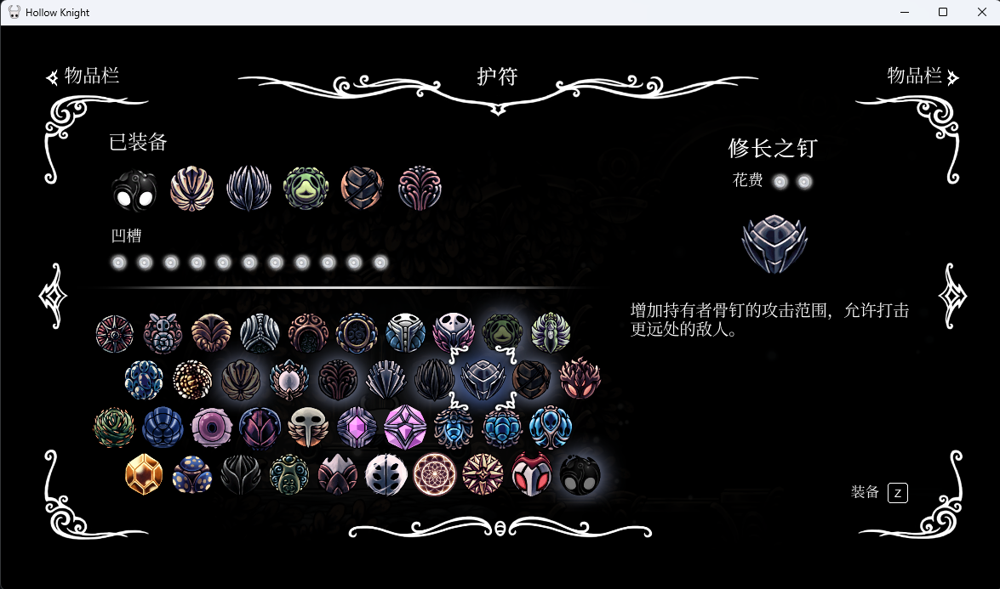

# HollowKnightRL_minimal_PPO
- 键位默认
- 分辨率：1176 x 664

## 目的：用最简单的奖励和动作，尽可能少的代码量打赢黄蜂女
- 奖励：玩家血量差值，boss 血量差值。（连胜负血量差值都没加）
- 动作：左右移动，面向左右，劈，上劈，下劈，跳劈
- 状态：连续 4 帧 84*84 游戏灰度图，玩家血量，boss 血量

### model
- stable_baselines3 默认的 PPO(policy="MultiInputPolicy")
- epoch = 6, step = 2689, boss_hp = -24

### 血条 mod
- 自动安装依赖：[Scarab](https://github.com/fifty-six/Scarab)
- 默认血条是红色的，不方便判断，改成黑背景白血条，参考 Enemy HP Bar/CustomHPBar/Default

### 护符
- 没带修长之钉，下次带上试试

  

### utils.py
- 捕获游戏窗口，画面
- 获取玩家血量坐标和 boss 血量：直接用基址和偏移量读内存。boss 血量不稳定，如果读不到，通过血量 MOD 计算
- 对战结束自动重开：判断是否在雕像前，判断难度

### Actions.py
- 随便自定义键位
- 如果想放技能，记得加上蓝量判断。如果蓝量不够就不要尝试放，会一整个呆住。
- 想用黑冲要加间隔判断，内置 cd=1.5s，不然学多了会在没无敌帧的情况也往 boss 脸上冲

### SendKey.py
- 祖传代码。用 pyautogui 延迟可能高一点
